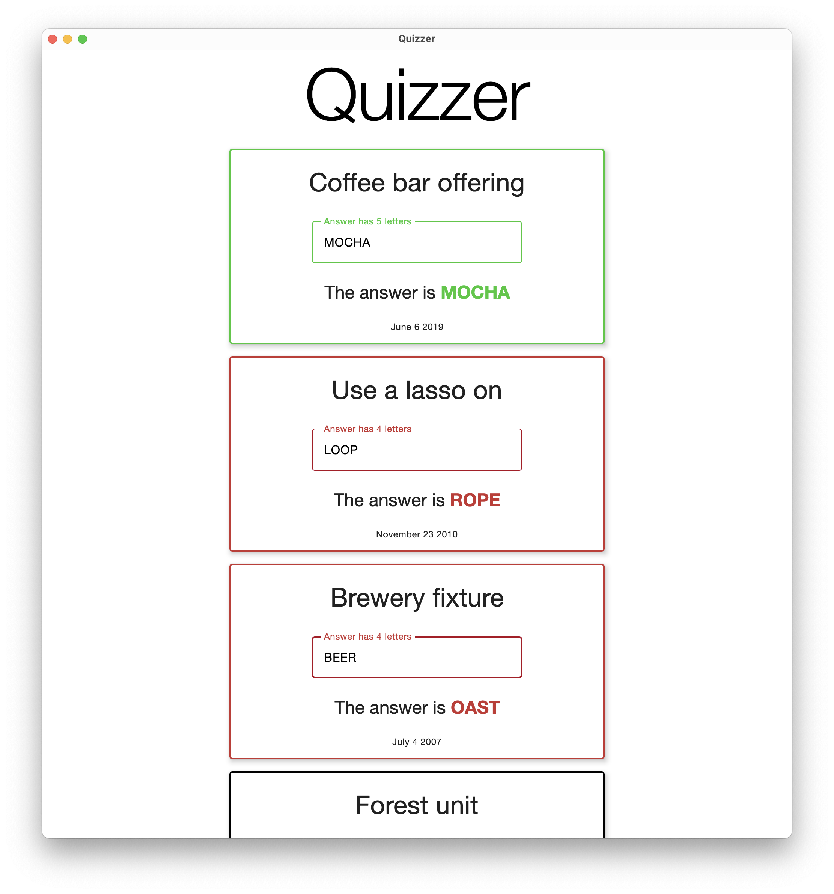
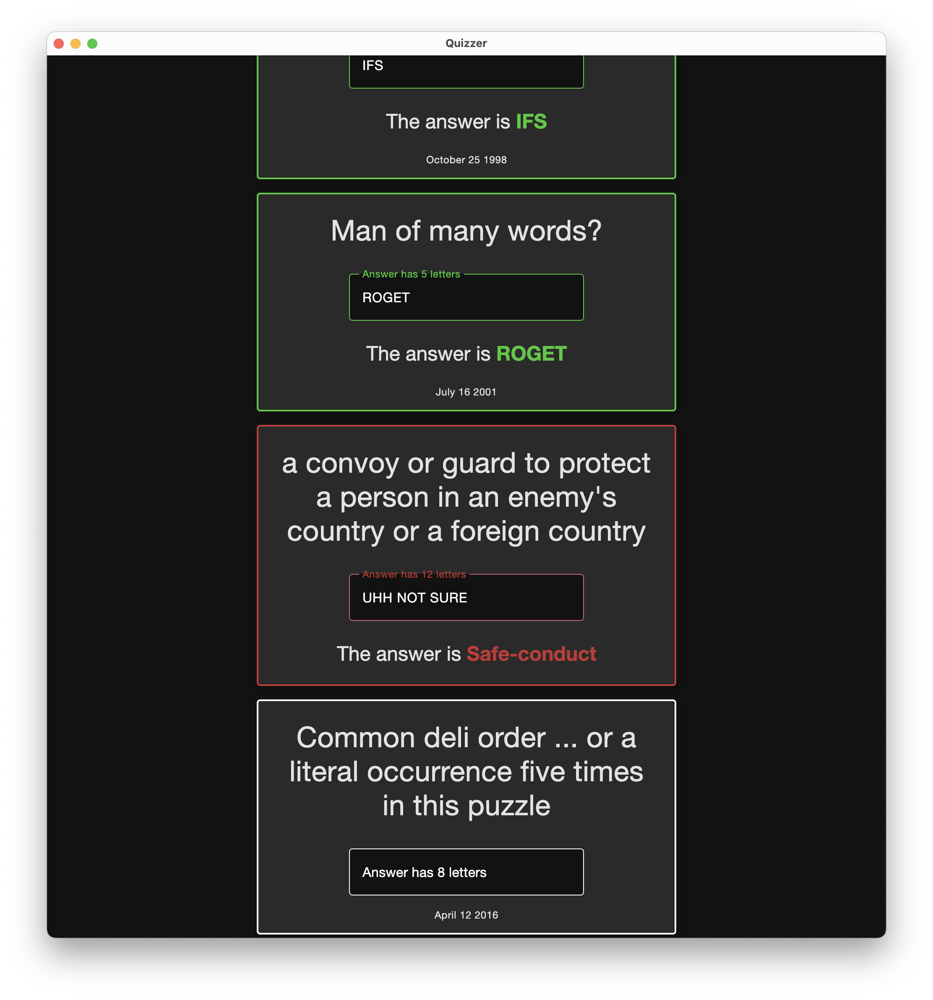
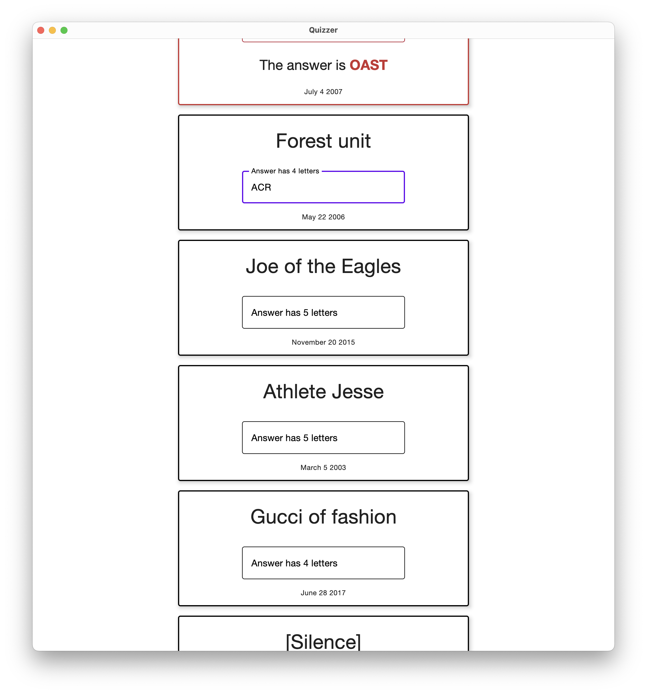
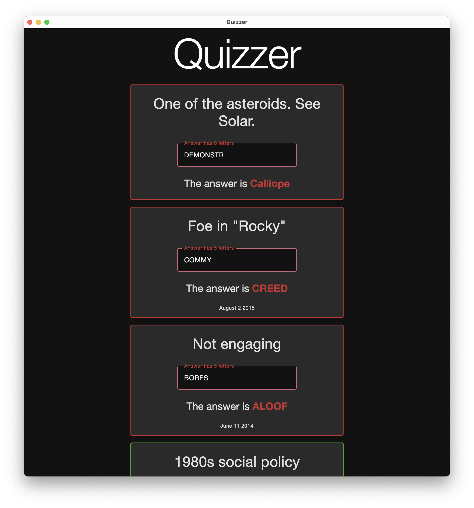

# CrossQuiz

CrossQuiz is a Kotlin Compose desktop application that quizzes users from a database of NYT crossword questions from 1993-2021 (and/or definitions from the dictionary). The app features a dark and light mode to suit your preference.

## Features

- Quiz yourself from a database of NYT crossword questions (or the dictionary!)
- Dark and light mode
- Randomized questions
- Questions light up red and green for right and wrong, making building streaks of correct answers visually satisfying.

## Screenshots









## Getting Started

1. Clone the repository:

```bash
git clone https://github.com/thabnir/CrossQuiz.git
```

2. Open the project in your preferred IDE (tested in IntelliJ IDEA)

3. Run the app by clicking on the Run button or by running the `main` function in `src/main/kotlin/Main.kt`

## How to Use

1. Open the app
2. Dark or light mode will be automatically selected for you based on your system's theme
3. Answer the questions you want to and scroll past those you don't
4. Try to build streaks of correct answers. How long can your green streak get?

## Technologies Used

- Kotlin
- Gradle
- Kotlin Compose

## License

This project is licensed under the MIT License - see [LICENSE.txt](LICENSE.txt) for details.
